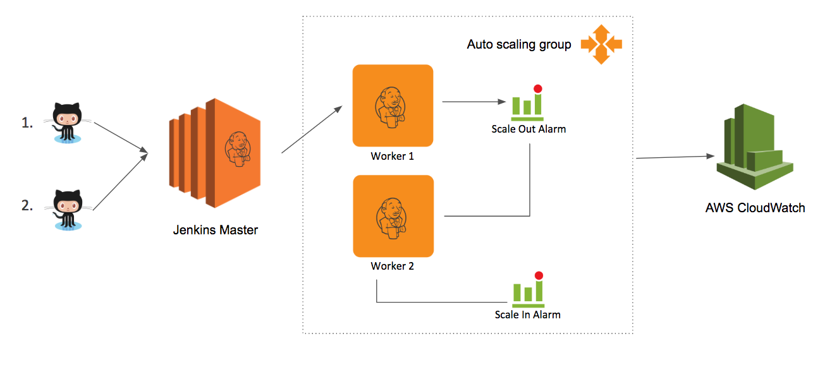

## Overloading Jenkins

Traditional Jenkins servers run multiple Jenkins job serially. In a growing company, there could be multiple jobs being run at a time and each job may have 1000+ automated tests. Running those jobs serially could take hours to days depending on the number and complexity of the automated tests in each job. The time complexity for the Jenkins server could be described as O(n) where n is the number of jobs.

This problem could be solved by adding more Jenkins servers connected to each other and run jobs in parallel. However, this setup will not be cost efficient because the servers may be used for 2 hours per day but still need to be paid for the other 22 hours.

## Jenkins++
Jenkins++ tries to solve the problems mentioned above by combining Jenkins and AWS auto-scaling groups, and save time and money when running the jobs. This is what the architecture looks like.

 

In the above architecture, when multiple developers are trying to run multiple jobs on a Jenkins server, the auto-scaling group will trigger a scale-out alarm creating more servers to run all the jobs in parallel and save runtime for jobs. When the jobs are done, the auto-scaling group will trigger a scale-in alarm terminating all the servers that are not used at the moment, thus saving costs for servers not being used.

## In a nutshell
Traditional Jenkins setup cost O(n) time to run multiple builds where n is the number of builds. Using more space to solve that problem may be costly considering you have to pay for those servers even when they are not in use. Using Jenkins++ will bring down the run time to a constant time where the total time taken will the time it takes to run the longest build. Also, it automatically terminates servers that are not used, reducing the cost by roughly 95% when the servers are there even when they are not used.

## Disclaimer
This is a readme of the project I did as a DevOps Engineering Fellow @ Insight. I used Jenkins and AWS services to create this project and 90% of this project is not code and made through the respective consoles. I want to point out that the correct way of recreating this project is using IaC(Infrastructure as Code), however due to time constraints, I used the GUI of each tool used. This repository only contains the code I wrote for a dummy app with a stress test that is connected to Jenkins++ server.
